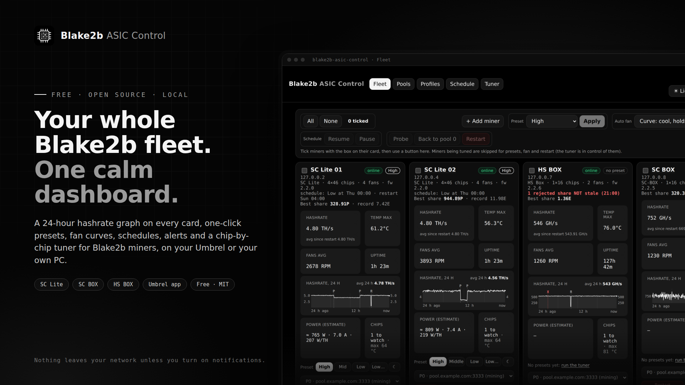
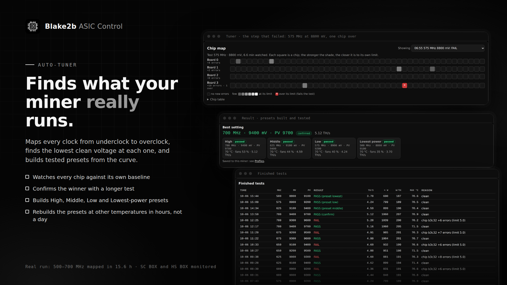
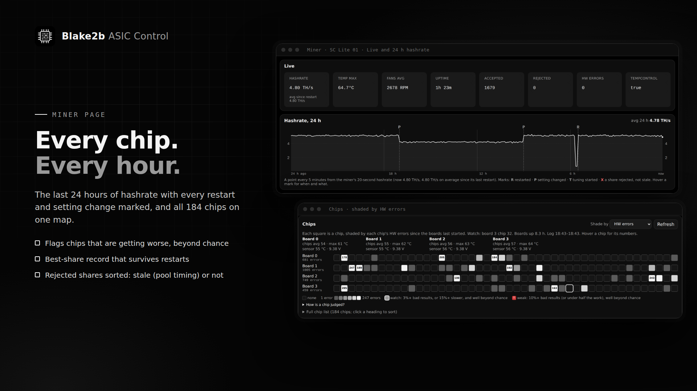
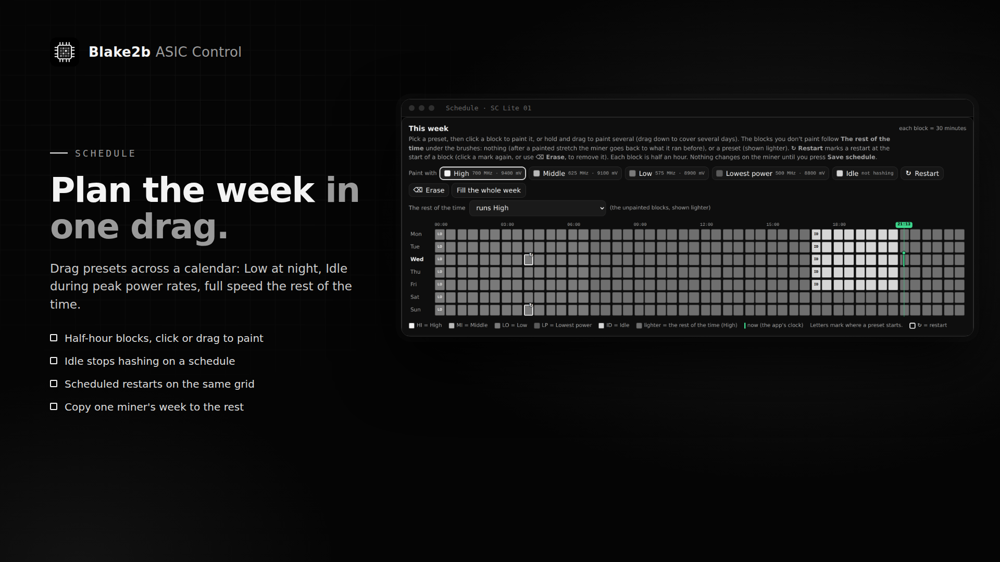
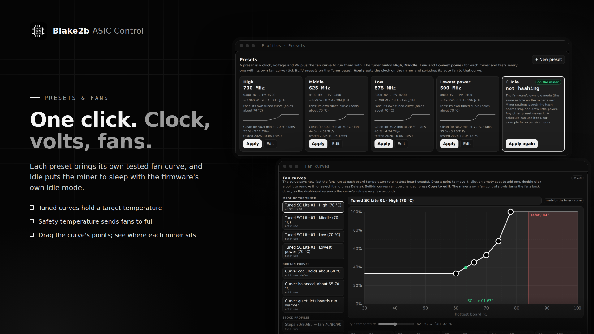
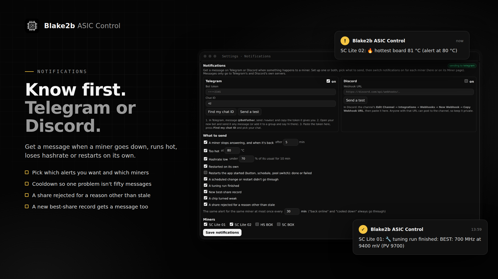

# Blake2b ASIC Control

A fleet dashboard, one-click presets, schedules, alerts and a per-chip auto-tuner for **Blake2b
miners** (SC Lite, SC Box, HS Box). It runs as an **Umbrel app** (this repo is also the Umbrel
community app store that serves it) or on any PC with Docker or Python. It talks to the miners' stock
web API only: no firmware changes, and nothing leaves your network unless you turn on notifications.



## What it does

- **Fleet:** a card per miner with its 20-second hashrate, a **24-hour hashrate graph** (marks for
  restarts, setting changes, tuning runs and rejected shares that weren't stale), one-click presets,
  an estimated power draw, chip health, a pool switcher, Restart with a progress bar, and a quick bar
  for the miners you tick.
- **Miner page:** live stats, the same 24-hour graph, a **chip map** of every chip on the hash boards
  (shaded by bad results, HW errors or speed, with weak chips flagged), each board's temperatures and
  voltage, the **best share** (with a record that survives restarts, on the same scale as DATUM and
  mempool so you can compare it with the network difficulty; or the miner's own number, or both) and
  **rejected shares** sorted into stale (pool timing, harmless) and not stale (worth a look).
- **Presets:** High, Middle, Low and Lowest power per miner: a clock, voltage, PV and the fan curve to
  run them with. **Idle** puts an SC Lite in the firmware's own sleep mode. One click applies a preset.
- **Fan curves:** drag the points of a curve (hottest board or chip → fan %); each miner runs its own,
  with a safety temperature that sends the fans to full.
- **Schedule:** paint presets across a week of half-hour blocks (say Low at night and Idle during
  peak power rates), with scheduled restarts on the same grid, and copy one miner's week to others.
- **Tuner** (SC Lite): maps every clock from underclock to overclock and finds the lowest voltage each
  one runs cleanly, judging every chip against its own normal error rate while holding the boards at a
  temperature you choose. It confirms the winner and builds and tests the four presets, each with its
  own fan curve. **Rebuild the presets** tests them again from the last search's curve (for example at
  another temperature) in a few hours instead of a day. Several miners can tune at once.
- **Notifications** on Telegram or Discord: a miner offline, too hot, low hashrate, restarted on its
  own, a scheduled change that failed, a tuning run finished, a new best-share record, a weak chip, a
  share rejected for a reason other than stale. Each kind and each miner on or off.
- **Pools** on several miners at once, **Settings** (account, time zone, best share numbers, notifications, a Miner
  reference explaining the miner's settings, web API, debug pages and port 4028 commands), Light and
  Dark themes, a phone layout and three Umbrel home-screen widgets (overview with estimated fleet power, fleet health gauges, miner list).







<sub>Screenshots use test miners (127.0.0.x addresses, example pools); the tuner results are from a
real SC Lite run.</sub>

## Models

| Model | Monitoring, chips, pools, restarts, best share, rejected shares, alerts | Presets, Idle, fan curves, schedule presets | Tuner |
|---|---|---|---|
| **SC Lite** (fw 2.2.0) | ✓ | ✓ | ✓ tested |
| **SC-BOX / SC-BOX II** | ✓ | clock and voltage read only; **fan target** (65–75 °C) | – |
| **HS BOX** | ✓ | clock and voltage read only; **fan target** (70–80 °C) | – |
| **SC5 Pro / SC5 Pro II** | ✓ (probe checked on a capture) | same plan format as the SC Lite, untested | allow "other models" to try |
| Other models | probe only | – | – |

The SC BOX and HS BOX write their power plan differently (`725 MHz 0.41 V 70 RPM 70 RPM`: decimal
volts, no PV; the HS BOX keeps one plan list per algorithm), so the app shows what they run but
leaves clock and voltage alone until changing that format has been tested on real units.

Their fans work differently too: the firmware ignores fan numbers and runs its own fan loop, which
speeds the fans up or down to hold the control board at a **fan target** (`temp_target`, inside the
range the firmware reports in `temp_targets`). That target is the one fan setting these models take,
so on their Miner page the fan panel offers **Fan target** instead of curves and fan %: lower is
cooler and louder, higher is quieter and warmer. Only `temp_target` is written; the settings are read
fresh and sent back as the miner gave them, so a manual clock stays as it is. Tested on both by
crProductGuy: the target holds and the fan loop steers to it within seconds. The SC Box's fans run
near full speed for about 15 minutes after a change, the HS Box's kept their speed. The control
appears only for these models (plan format "box" with a fan target range), and changes are at least
a minute apart.

**Have a model or firmware that isn't tested yet?** Open **Profiles**, pick the miner and press
**Download report**. It reads the miner (one request at a time, nothing is changed, about 30 s) and
saves a zip of what support takes: how it writes clock and voltage, its boards and chips, what its own
pages answer and, if ticked, its log. The MAC address, IP addresses, pool URLs, wallets, workers and
tokens are taken out, and the pool and WiFi settings aren't read at all. It's plain text, so look it
over, then attach it to a [new issue](https://github.com/christhealien/blake2b-asic-control/issues/new)
saying which unit it is. Support is only claimed for a model after a report like this and a test on a
real unit.

## Install

**On Umbrel:** App Store → ⋯ (top right) → **Community App Stores** → add
`https://github.com/christhealien/blake2b-asic-control` → open **christhealien Store** → install
**Blake2b ASIC Control**. Sign in with the username and password Umbrel shows for the app, then:

1. **Settings → Time zone:** pick yours (schedules and restarts run on it; it starts on UTC).
2. **Settings → Add miner:** its IP and admin password. It's probed by itself within a minute.
3. To tune an SC Lite: the **Tuner** tab. Read the disclaimer on the sign-in page first.

**Without Umbrel** (Docker, or Python on Linux / macOS / Windows): see [TESTING.md](TESTING.md).
**Demo miners** (Settings → Demo miners) let you look around without touching a real one.

> **⚠ Overclocking and voltage changes can damage hardware and void warranties.** The tuner and presets
> change clock, voltage and fans on real miners. Every value is checked against each miner's limits and
> a board reaching the abort temperature stops a run, but you use it at your own risk.

## Security

- **Keep miners and the Umbrel on a trusted network.** The miners' own interfaces have no real
  security: their login is sent over plain HTTP with a key every copy of the firmware shares, and port
  4028 needs no login at all. Anyone on the same network can reach them. A separate network (VLAN) for
  miners is best, and never forward their ports to the internet.
- **This app's login is the only gate** (Umbrel's own login is skipped so you don't sign in twice).
  Use a long password.
- **Other apps on the same Umbrel are trusted by your browser** (same host name), so only install
  apps you trust. Changes still need this app's own pages (a request header other pages can't add),
  but your session cookie is sent to any app on that host.
- **Outbound traffic:** the app talks to your miners, and to nothing else unless you set up
  notifications: then only to `api.telegram.org` and/or `discord.com` (the webhook you paste). The bot
  token and webhook URL are kept in `miners.json` and never sent back to the page.
- `miners.json` holds your miners' admin passwords (the miners need them in clear text); the app keeps
  it readable by itself only.
- Clock, voltage, PV and fan values are checked on the server against each miner's limits for every
  way of setting them.
- The sign-in back-off goes by the client's address. On Umbrel, `SCLITE_BEHIND_PROXY=1` (set in the
  compose file) makes it trust the address app_proxy forwards. Elsewhere leave it unset unless a
  reverse proxy you control sits in front and sets `X-Forwarded-For`; otherwise a client could make up
  a fresh address for every guess.

## Data

Everything that changes is in the app's data folder (on Umbrel
`~/umbrel/app-data/blake2b-asic-control/data`):

- `miners.json`: your miners and what each was detected as (including its stock setting), their
  auto-fan settings, fan curves (`profiles`), presets (`presets`), schedules (`schedules`), power
  calibrations (`power_cal`), mains voltage (`power`), notifications (`notify`), the time zone, how best shares are shown (`share_scale`) and, on an SC Box or HS Box, the last fan target the app set (`fan_target_set`).
- `auth.json`: the login (hashed) and a log of disclaimer acknowledgements. It's first created from
  Umbrel's default login for the app. Delete it and restart the app to go back to that default.
- `sessions.json`: who is signed in.
- `best_shares.json`: each miner's best share since restart, its record and its 20 biggest finds.
- `hashrate.json`: each miner's hashrate every 5 minutes for 24 hours, and the marks on its graph.
- `rejects.json`: each miner's accepted / rejected shares per hour (8 days) and its rejected-share
  events (7 days: when, stale or not, and the short reason word; no other log text).
- `restart_times.json`: how long each miner's last 5 restarts took (for the Fleet card's progress bar).
- `tuner/<miner id>/`: that miner's `asic_tuner_*` results, live readings, chip errors, presets, run
  plan, every run's options, what the last rebuild was built from, and the log, all downloadable from
  the Tuner page (one at a time or as a zip).

## Layout

```
umbrel-app-store.yml          the store: id "blake2b", name "christhealien Store"
blake2b-asic-control/         the Umbrel app (manifest, compose, icon, gallery)
app/                          the source and Dockerfile (the image's build context)
.github/workflows/image.yml   builds the image for amd64 and arm64 and pushes it to ghcr.io
TESTING.md                    running it without an Umbrel (Docker or Python)
CHANGELOG.md                  every version and what changed
THIRD_PARTY_NOTICES.md        the licenses of the projects it builds on
```

Umbrel only reads `*/umbrel-app.yml` in a store repo, so `app/` is ignored by it.

| File in `app/` | What it is |
|---|---|
| `Dockerfile` | Downloads the dashboard this builds on (pinned), adds the files below and patches them in |
| `entrypoint.sh` | Starts the dashboard and widgets. On shutdown it stops every tuning run so each one restores its best setting |
| `install_addons.py` | Wires every page, route, the login and the Fleet changes into the dashboard (runs during the build) |
| `asic_tuner.py` | The per-chip tuner, including the fan hold, presets and rebuilds |
| `tuner_addon.py` / `tuner.html` | The Tuner API (one run and folder per miner) and the Tuner page |
| `fan_addon.py` / `profiles.html` | Fan curves, presets and Idle, probing, the chip list, locks, restart, time zone and demo miners, plus the Profiles page |
| `schedule_addon.py` / `schedule.html` | Per-miner schedules and the engine that applies them, plus the Schedule page |
| `addon.js` | Fleet, Miner page and Settings additions (quick bar, card buttons, graphs, chip map, locks) |
| `shares_addon.py` | Best share tracking: since restart, the record and every new best as it is found |
| `hashrate_addon.py` | The 24-hour hashrate history and marks behind the graphs |
| `report_addon.py` | Download report: a miner's read-only answers, private details taken out, as a zip |
| `rejects_addon.py` | Rejected shares: counts per hour, and stale vs not stale from the miner's own log |
| `notify_addon.py` | Notifications: the watcher, and sending to Telegram / Discord |
| `health_addon.py` | Chip health from the miner's own log: each chip's share of bad results, chip temperatures and voltage |
| `miner_safety.py` | Paced, bounded reads from miners, and miner-reported text cleaned before it reaches a page |
| `auth_addon.py` / `login.html` | The login and the sign-in page |
| `theme.css` / `theme.js` | The monochrome look with Light / Dark |
| `widget_server.py` | The Umbrel home-screen widgets (internal port 8788) |
| `run-local.sh` / `run-local.ps1` | Run it without Docker (see TESTING.md) |

## Releasing a new version

1. Put the new number in `blake2b-asic-control/docker-compose.yml` (`image:`),
   `blake2b-asic-control/umbrel-app.yml` (`version:`, the `?v=` on the icon and gallery URLs, and the
   release notes) and `app/Dockerfile` (the version label), and add it to `CHANGELOG.md`.
2. Commit and push, then tag it: `git tag v1.14.1 && git push origin v1.14.1`.
3. The **image** workflow builds the image and pushes `ghcr.io/christhealien/blake2b-asic-control:<version>`
   (GitHub → Actions shows it; about 10–15 minutes for both architectures).
4. Umbrel checks stores every few minutes and offers the update once the new manifest is there.

The store's "What's new" (`releaseNotes`) is markdown, and a community store app shows only one entry,
so it keeps a rolling list: the new version on top, earlier ones as one-line bullets, and a link to
CHANGELOG.md for everything.

## Credits

- **[Maveth's web dashboard](https://github.com/Maveth/goldshell-config)** (MaVeTh / BitcoinMechanic,
  MIT): the fleet dashboard, miner client, fan controller, probe and SC Lite helpers this app builds
  on. The build downloads it at a pinned commit and patches it; its MIT license files come along into
  the image. See [THIRD_PARTY_NOTICES.md](THIRD_PARTY_NOTICES.md).
- **[crProductGuy's box tools](https://github.com/crProductGuy/goldshell-box-tools-productguy)**
  (MIT): its firmware API notes are where the restart method comes from (a `PUT` to `/mcb/restart`;
  the miner ignores a `GET`); its stale-share proposal is where the Rejected shares design comes from
  (stale means exactly `(stale-prevblk)`; anything else is flagged; rejects the log doesn't account for
  are said, never guessed); its sanitized SC5 Pro II capture was used to check a second model's stock
  plan and best-share fields; and **crProductGuy tested this app on an SC BOX and an HS BOX**, with the
  read-only captures and write tests that the box support is built from. Maveth's dashboard also adapts
  parts of that project (board parsing, the soft watchdog) and credits it in its own ATTRIBUTION.md.

This project is not affiliated with or endorsed by any miner manufacturer.

## License

[MIT](LICENSE) for this repository's own files. The projects it builds on keep their own MIT licenses
and notices: see [THIRD_PARTY_NOTICES.md](THIRD_PARTY_NOTICES.md).
